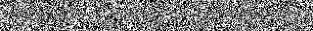
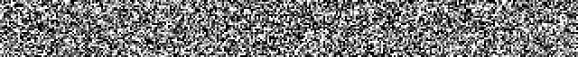
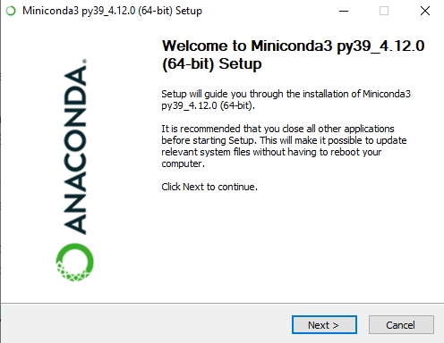
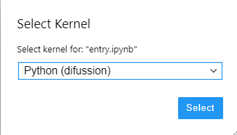
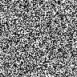
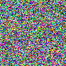
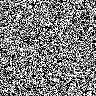

# Diffusion Models in Artificial Intelligence

Dear all, today we are going to discuss the buildings blocks of the Diffusion Models applied to Artificial Intelligence.

We are interested to know  how the diffusion works. The achievement of those technologies has been possible thanks to the long scientific works during the History. In this blog post, we are going to  build an interesting program in python that will generate images by using the diffusion and recap the theory of the diffusion process like the following

### MNIST



### Fashion-MNIST



### CIFAR


# Introduction

One of the greatest ideas that allows the Artificial Intelligence build images from a text is the Markov chain. Andrey Markov studied Markov processes in the early 20th century, publishing his first paper on the topic in 1906. Important people contributed to his research such Heinri Poincare , Ehrenfest , Andrey Kolmogorov.Kolmogorov was partly inspired by Louis Bachelier's 1900 work on fluctuations in the stock market as well as Norbert Wiener's work on Einstein's model of Brownian movement.


A Markov chain or Markov process is a stochastic model describing a sequence of possible events in which the probability of each event depends only on the state attained in the previous event.

A Markov process is a stochastic process that satisfies the Markov property. In simpler terms, it is a process for which predictions can be made regarding future outcomes based solely on its present state and—most importantly—such predictions are just as good as the ones that could be made knowing the process's full history. In other words, conditional on the present state of the system, its future and past states are independent.

Diffusion models are a new class of state-of-the-art generative models that generate diverse high-resolution images. They have already attracted a lot of attention after OpenAI, Nvidia and Google managed to train large-scale models. Example architectures that are based on diffusion models are GLIDE, DALLE-2, Imagen, and the full open-source stable diffusion.

But what is the main principle behind them?


## Step 1.  Installation of the libraries.

In this project we require a computer with GPU,  for this reason we can work in AWS SageMaker  Notebook, then you simply  click **File>New>Terminal** and type

```
wget https://raw.githubusercontent.com/ruslanmv/Diffusion-Models-in-Machine-Learning/master/setup.sh
```

and type

```
sh setup.sh
```

and skip the next step. 

Otherwise if you are working locally, clone the following repository

```
git clone https://github.com/ruslanmv/Diffusion-Models-in-Machine-Learning.git
```

then

```
cd Diffusion-Models-in-Machine-Learning
```

## Step 2. Creation of the environment

You can install miniconda at this [link](https://docs.conda.io/en/latest/miniconda.html) in your personal computer.



we create an environment called **diffusion**, but you can put the name that you like.

```
conda create -n diffusion python==3.8 jupyter -y
```

If you are running anaconda for first time, you should init conda with the shell that you want to work, in this case I choose the cmd.exe

```
conda init cmd.exe
```

and then close and open the terminal

```
conda activate diffusion
```

then in your terminal type the following commands:

```
conda install ipykernel -y
```

```
python -m ipykernel install --user --name diffusion --display-name "Python (diffusion)"
```


In this project we are going to use the following libraries:

* PyTorch
* PyTorch-Lightning
* Torchvision
* imageio (for gif generation)

```
pip install  torch pytorch_lightning  imageio torchvision
```

## Step 3

Use the provided [`entry-MNIST.ipynb`](./entry-MNIST.ipynb) notebook to train model and sample generated images. 

That supports MNIST, Fashion-MNIST and CIFAR datasets.

Then you select the Kernel **Python (diffusion)**



If you want uninstall you enviroment

```
conda env remove -n  diffusion
```

List all kernels and grap the name of the kernel you want to remove

```
jupyter kernelspec list
```

Remove it

```
jupyter kernelspec remove diffusion
```


## Denoising Diffusion Probabilistic Models


```python
import torch
from data import DiffSet
import pytorch_lightning as pl
from model import DiffusionModel
from torch.utils.data import DataLoader
import imageio
import glob
```


```python
!nvidia-smi
```

    Sun Oct  9 12:19:32 2022       
    +-----------------------------------------------------------------------------+
    | NVIDIA-SMI 510.47.03    Driver Version: 510.47.03    CUDA Version: 11.6     |
    |-------------------------------+----------------------+----------------------+
    | GPU  Name        Persistence-M| Bus-Id        Disp.A | Volatile Uncorr. ECC |
    | Fan  Temp  Perf  Pwr:Usage/Cap|         Memory-Usage | GPU-Util  Compute M. |
    |                               |                      |               MIG M. |
    |===============================+======================+======================|
    |   0  Tesla T4            On   | 00000000:00:1E.0 Off |                    0 |
    | N/A   73C    P0    65W /  70W |   4285MiB / 15360MiB |     92%      Default |
    |                               |                      |                  N/A |
    +-------------------------------+----------------------+----------------------+
                                                                                   
    +-----------------------------------------------------------------------------+
    | Processes:                                                                  |
    |  GPU   GI   CI        PID   Type   Process name                  GPU Memory |
    |        ID   ID                                                   Usage      |
    |=============================================================================|
    |    0   N/A  N/A     12561      C   ...envs/diffusion/bin/python     4283MiB |
    +-----------------------------------------------------------------------------+


### Set model parameters


```python
# Training hyperparameters
diffusion_steps = 1000
#dataset_choice = "CIFAR"
dataset_choice = "MNIST"
#dataset_choice = "Fashion"
max_epoch = 10
batch_size = 128
# Loading parameters
load_model = False
load_version_num = 1
```

### Load dataset and train model


```python
# Code for optionally loading model
pass_version = None
last_checkpoint = None

if load_model:
    pass_version = load_version_num
    last_checkpoint = glob.glob(
        f"./lightning_logs/{dataset_choice}/version_{load_version_num}/checkpoints/*.ckpt"
    )[-1]
```


```python
# Create datasets and data loaders
train_dataset = DiffSet(True, dataset_choice)
val_dataset = DiffSet(False, dataset_choice)

train_loader = DataLoader(train_dataset, batch_size=batch_size, num_workers=4, shuffle=True)
val_loader = DataLoader(val_dataset, batch_size=batch_size, num_workers=4, shuffle=True)

# Create model and trainer
if load_model:
    model = DiffusionModel.load_from_checkpoint(last_checkpoint, in_size=train_dataset.size*train_dataset.size, t_range=diffusion_steps, img_depth=train_dataset.depth)
else:
    model = DiffusionModel(train_dataset.size*train_dataset.size, diffusion_steps, train_dataset.depth)
```

    Downloading http://yann.lecun.com/exdb/mnist/train-images-idx3-ubyte.gz
    Downloading http://yann.lecun.com/exdb/mnist/train-images-idx3-ubyte.gz to ./data/MNIST/raw/train-images-idx3-ubyte.gz


    100%|██████████| 9912422/9912422 [00:00<00:00, 195221378.17it/s]
    Extracting ./data/MNIST/raw/train-images-idx3-ubyte.gz to ./data/MNIST/raw


​    


```python
# Load Trainer model
tb_logger = pl.loggers.TensorBoardLogger(
    "lightning_logs/",
    name=dataset_choice,
    version=pass_version,
)

trainer = pl.Trainer(
    max_epochs=max_epoch, 
    log_every_n_steps=10, 
    gpus=1, 
    auto_select_gpus=True,
    resume_from_checkpoint=last_checkpoint, 
    logger=tb_logger
)
```

    /home/ec2-user/anaconda3/envs/diffusion/lib/python3.8/site-packages/pytorch_lightning/trainer/connectors/accelerator_connector.py:447: LightningDeprecationWarning: Setting `Trainer(gpus=1)` is deprecated in v1.7 and will be removed in v2.0. Please use `Trainer(accelerator='gpu', devices=1)` instead.
      rank_zero_deprecation(
    Auto select gpus: [0]
    GPU available: True (cuda), used: True
    TPU available: False, using: 0 TPU cores
    IPU available: False, using: 0 IPUs
    HPU available: False, using: 0 HPUs


```python
# Train model
trainer.fit(model, train_loader, val_loader)
```

    Missing logger folder: lightning_logs/MNIST
    LOCAL_RANK: 0 - CUDA_VISIBLE_DEVICES: [0]
    
       | Name  | Type       | Params
    --------------------------------------
    0  | inc   | DoubleConv | 37.7 K
    1  | down1 | Down       | 295 K 
    2  | down2 | Down       | 1.2 M 
    3  | down3 | Down       | 2.4 M 
    4  | up1   | Up         | 6.2 M 
    5  | up2   | Up         | 1.5 M 
    6  | up3   | Up         | 406 K 
    7  | outc  | OutConv    | 65    
    8  | sa1   | SAWrapper  | 395 K 
    9  | sa2   | SAWrapper  | 395 K 
    10 | sa3   | SAWrapper  | 99.6 K
    --------------------------------------
    12.9 M    Trainable params
    0         Non-trainable params
    12.9 M    Total params
    51.676    Total estimated model params size (MB)


    Epoch 9: 100%|██████████| 548/548 [02:33<00:00,  3.57it/s, loss=0.0211, v_num=0]


### Sample from model


```python
gif_shape = [3, 3]
sample_batch_size = gif_shape[0] * gif_shape[1]
n_hold_final = 10

# Generate samples from denoising process
gen_samples = []
x = torch.randn((sample_batch_size, train_dataset.depth, train_dataset.size, train_dataset.size))
sample_steps = torch.arange(model.t_range-1, 0, -1)
for t in sample_steps:
    x = model.denoise_sample(x, t)
    if t % 50 == 0:
        gen_samples.append(x)
for _ in range(n_hold_final):
    gen_samples.append(x)
gen_samples = torch.stack(gen_samples, dim=0).moveaxis(2, 4).squeeze(-1)
gen_samples = (gen_samples.clamp(-1, 1) + 1) / 2
```


```python
# Process samples and save as gif
gen_samples = (gen_samples * 255).type(torch.uint8)
gen_samples = gen_samples.reshape(-1, gif_shape[0], gif_shape[1], train_dataset.size, train_dataset.size, train_dataset.depth)

def stack_samples(gen_samples, stack_dim):
    gen_samples = list(torch.split(gen_samples, 1, dim=1))
    for i in range(len(gen_samples)):
        gen_samples[i] = gen_samples[i].squeeze(1)
    return torch.cat(gen_samples, dim=stack_dim)

gen_samples = stack_samples(gen_samples, 2)
gen_samples = stack_samples(gen_samples, 2)

imageio.mimsave(
    f"{trainer.logger.log_dir}/pred.gif",
    list(gen_samples),
    fps=5,
)
```


```python
from IPython.display import Markdown as md
gif=f"{trainer.logger.log_dir}/pred.gif"
md(""%(gif))
```

The results for MNIST:





CIFAR:



Fashion-MNIST:




