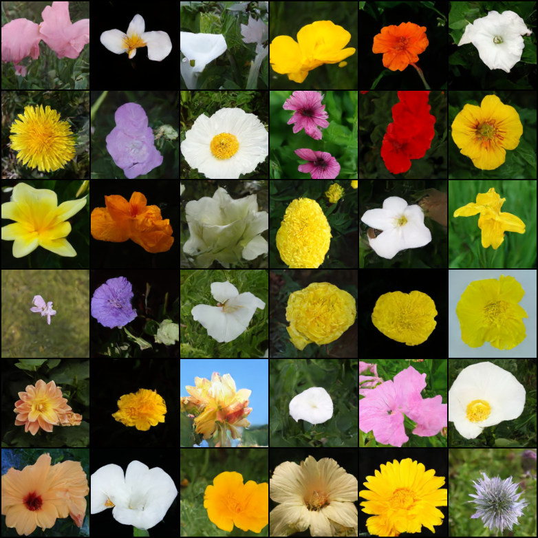

# Introduction to Diffusion Models in Artificial Intelligence

Dear all, today we are going to discuss the buildings blocks of the Diffusion Models applied to Artificial Intelligence.

We are interested to know what are the basic elements of the.
Text to Image works.

In particular the DALLE-2 and IMAGEN from Google.

The achievement of those technologies has been possible thanks to the long scientific works during the History.

In this blog post I will focus on the Diffusion Models.

# Introduction

One of the greatest ideas that allows the Artificial Intelligence build images from a text is the Markov chain.

Andrey Markov studied Markov processes in the early 20th century, publishing his first paper on the topic in 1906.
Important people contributed to his research such Heinri Poincare ,
Ehrenfest , Andrey Kolmogorov.

Kolmogorov was partly inspired by Louis Bachelier's 1900 work on fluctuations in the stock market as well as Norbert Wiener's work on Einstein's model of Brownian movement.


A Markov chain or Markov process is a stochastic model describing a sequence of possible events in which the probability of each event depends only on the state attained in the previous event.

A Markov process is a stochastic process that satisfies the Markov property. In simpler terms, it is a process for which predictions can be made regarding future outcomes based solely on its present state and—most importantly—such predictions are just as good as the ones that could be made knowing the process's full history. In other words, conditional on the present state of the system, its future and past states are independent.


# Denoising Diffusion Probabilistic Model, in Pytorch


</img>


Implementation of <a href="https://arxiv.org/abs/2006.11239">Denoising Diffusion Probabilistic Model</a> in Pytorch. It is a new approach to generative modeling that may <a href="https://ajolicoeur.wordpress.com/the-new-contender-to-gans-score-matching-with-langevin-sampling/">have the potential</a> to rival GANs. It uses denoising score matching to estimate the gradient of the data distribution, followed by Langevin sampling to sample from the true distribution.

This implementation was transcribed from the official Tensorflow version <a href="https://github.com/hojonathanho/diffusion">here</a>

Youtube AI Educators - <a href="https://www.youtube.com/watch?v=W-O7AZNzbzQ">Yannic Kilcher</a> | <a href="https://www.youtube.com/watch?v=344w5h24-h8">AI Coffeebreak with Letitia</a> | <a href="https://www.youtube.com/watch?v=HoKDTa5jHvg">Outlier</a>

<a href="https://github.com/yiyixuxu/denoising-diffusion-flax">Flax implementation</a> from <a href="https://github.com/yiyixuxu">YiYi Xu</a>

<a href="https://huggingface.co/blog/annotated-diffusion">Annotated code</a> by Research Scientists / Engineers from <a href="https://huggingface.co/">🤗 Huggingface</a>

Update: Turns out none of the technicalities really matters at all | <a href="https://arxiv.org/abs/2208.09392">"Cold Diffusion" paper</a>



[](https://badge.fury.io/py/denoising-diffusion-pytorch)

## Install

```bash
$ pip install denoising_diffusion_pytorch
```

## Usage

```python
import torch
from denoising_diffusion_pytorch import Unet, GaussianDiffusion

model = Unet(
    dim = 64,
    dim_mults = (1, 2, 4, 8)
)

diffusion = GaussianDiffusion(
    model,
    image_size = 128,
    timesteps = 1000,   # number of steps
    loss_type = 'l1'    # L1 or L2
)

training_images = torch.randn(8, 3, 128, 128) # images are normalized from 0 to 1
loss = diffusion(training_images)
loss.backward()
# after a lot of training

sampled_images = diffusion.sample(batch_size = 4)
sampled_images.shape # (4, 3, 128, 128)
```

Or, if you simply want to pass in a folder name and the desired image dimensions, you can use the `Trainer` class to easily train a model.

```python
from denoising_diffusion_pytorch import Unet, GaussianDiffusion, Trainer

model = Unet(
    dim = 64,
    dim_mults = (1, 2, 4, 8)
).cuda()

diffusion = GaussianDiffusion(
    model,
    image_size = 128,
    timesteps = 1000,           # number of steps
    sampling_timesteps = 250,   # number of sampling timesteps (using ddim for faster inference [see citation for ddim paper])
    loss_type = 'l1'            # L1 or L2
).cuda()

trainer = Trainer(
    diffusion,
    'path/to/your/images',
    train_batch_size = 32,
    train_lr = 8e-5,
    train_num_steps = 700000,         # total training steps
    gradient_accumulate_every = 2,    # gradient accumulation steps
    ema_decay = 0.995,                # exponential moving average decay
    amp = True                        # turn on mixed precision
)

trainer.train()
```

Samples and model checkpoints will be logged to `./results` periodically

## Multi-GPU Training

The `Trainer` class is now equipped with <a href="https://huggingface.co/docs/accelerate/accelerator">🤗 Accelerator</a>. You can easily do multi-gpu training in two steps using their `accelerate` CLI

At the project root directory, where the training script is, run

```python
$ accelerate config
```

Then, in the same directory

```python
$ accelerate launch train.py
```
