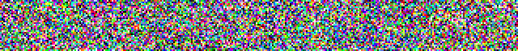
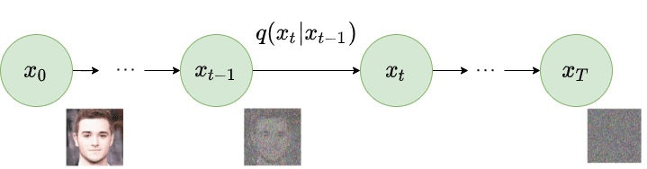
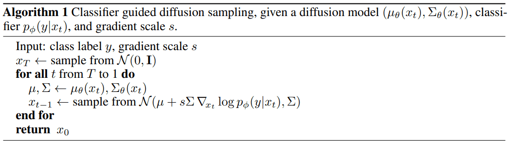
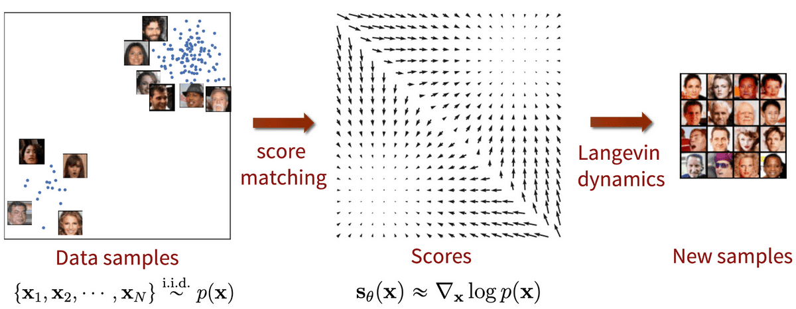
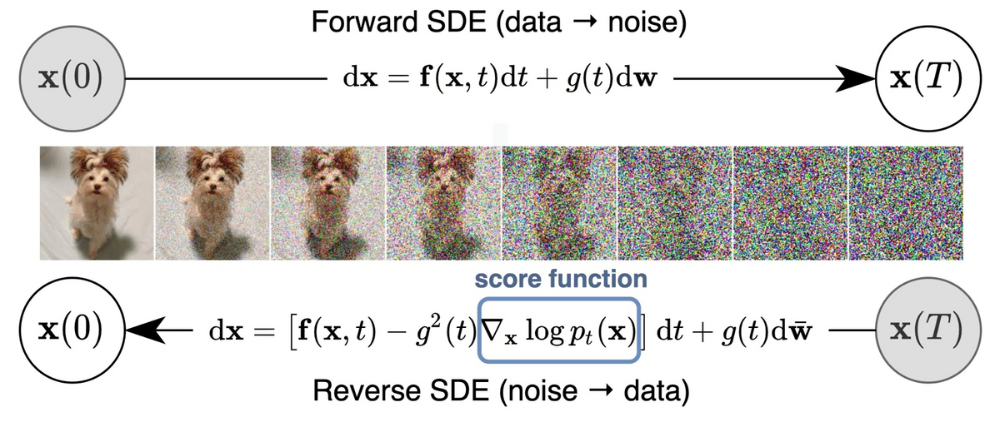
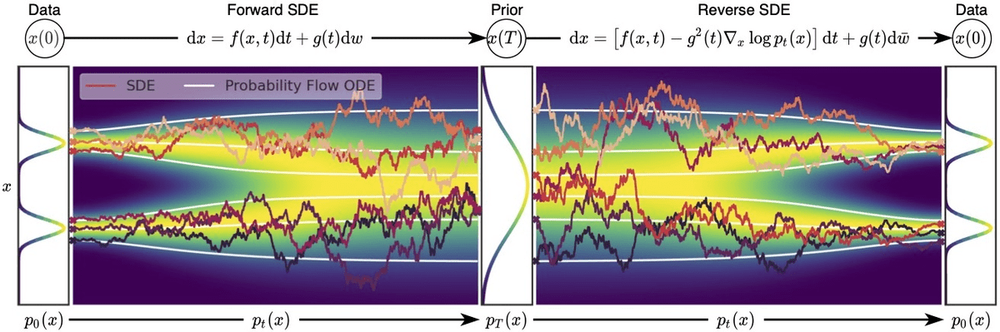

# Diffusion Models in Artificial Intelligence

Dear all, today we are going to discuss the buildings blocks of the Diffusion Models applied to Artificial Intelligence.

We are interested to know what are the basic elements of the.
Text to Image works.

In particular the DALLE-2 and IMAGEN from Google.

The achievement of those technologies has been possible thanks to the long scientific works during the History.

In this blog post I will focus on the Diffusion Models.


## Step 1. Creation of the environment

### Installation of Conda

First you need to install anaconda at this [link](https://www.anaconda.com/products/individual)


I will create an environment called **difussion**, but you can put the name that you like.

```
conda create -n difussion python==3.7
```

If you are running anaconda for first time, you should init conda with the shell that you want to work, in this case I choose the cmd.exe

```
conda init cmd.exe
```

and then close and open the terminal

```
conda activate difussion
```

then in your terminal type the following commands:

```
conda install ipykernel
python -m ipykernel install --user --name difussion --display-name "Python (difussion)"
```


Use the provided [`entry.ipynb`](./entry.ipynb) notebook to train model and sample generated images. 

Supports MNIST, Fashion-MNIST and CIFAR datasets.

## Requirements

* PyTorch
* PyTorch-Lightning
* Torchvision
* imageio (for gif generation)

## Generated Images

### MNIST


### Fashion-MNIST


### CIFAR



# Introduction

One of the greatest ideas that allows the Artificial Intelligence build images from a text is the Markov chain.

Andrey Markov studied Markov processes in the early 20th century, publishing his first paper on the topic in 1906.
Important people contributed to his research such Heinri Poincare ,
Ehrenfest , Andrey Kolmogorov.

Kolmogorov was partly inspired by Louis Bachelier's 1900 work on fluctuations in the stock market as well as Norbert Wiener's work on Einstein's model of Brownian movement.


A Markov chain or Markov process is a stochastic model describing a sequence of possible events in which the probability of each event depends only on the state attained in the previous event.

A Markov process is a stochastic process that satisfies the Markov property. In simpler terms, it is a process for which predictions can be made regarding future outcomes based solely on its present state and—most importantly—such predictions are just as good as the ones that could be made knowing the process's full history. In other words, conditional on the present state of the system, its future and past states are independent.

Diffusion models are a new class of state-of-the-art generative models that generate diverse high-resolution images. They have already attracted a lot of attention after OpenAI, Nvidia and Google managed to train large-scale models. Example architectures that are based on diffusion models are GLIDE, DALLE-2, Imagen, and the full open-source stable diffusion.

But what is the main principle behind them?


`Denoising Diffusion Probabilistic Models`, the recent paper by [Ho et al., 2020](https://arxiv.org/abs/2006.11239). A nice summary of the paper by the authors is available [here](https://hojonathanho.github.io/diffusion/). 

In this blog post, we will dig our way up from the basic principles. There are already a bunch of different diffusion-based architectures. We will focus on the most prominent one, which is the Denoising Diffusion Probabilistic Models (DDPM) as initialized by [Sohl-Dickstein et al](https://arxiv.org/abs/1503.03585) and then proposed by [Ho. et al 2020](https://arxiv.org/abs/2006.11239). Various other approaches will be discussed to a smaller extent such as stable diffusion and score-based models.

> Diffusion models are fundamentally different from all the previous generative methods. Intuitively, they aim to decompose the image generation process (sampling) in many small “denoising” steps.

The intuition behind this is that the model can correct itself over these small steps and gradually produce a good sample. To some extent, this idea of refining the representation has already been used in models like [alphafold](https://youtu.be/nGVFbPKrRWQ?t=1148). But hey, nothing comes at zero-cost. This iterative process makes them slow at sampling, at least compared to [GANs](https://theaisummer.com/gan-computer-vision/).

## Diffusion process

The basic idea behind diffusion models is rather simple. They take the input image \mathbf{x}_0**x**0 and gradually add Gaussian noise to it through a series of T*T* steps. We will call this the forward process. Notably, this is unrelated to the forward pass of a neural network. If you'd like, this part is necessary to generate the targets for our neural network (the image after applying t<T*t*<*T* noise steps).

Afterward, a neural network is trained to recover the original data by reversing the noising process. By being able to model the reverse process, we can generate new data. This is the so-called reverse diffusion process or, in general, the sampling process of a generative model.

How? Let’s dive into the math to make it crystal clear.

## Forward diffusion

Diffusion models can be seen as latent variable models. Latent means that we are referring to a hidden continuous feature space. In such a way, they may look similar to [variational autoencoders (VAEs)](https://theaisummer.com/latent-variable-models/).

In practice, they are formulated using a Markov chain of T*T* steps. Here, a Markov chain means that each step only depends on the previous one, which is a mild assumption. Importantly, we are not constrained to using a specific type of neural network, unlike [flow-based models](https://lilianweng.github.io/posts/2018-10-13-flow-models/).

Given a data-point \textbf{x}_0**x**0 sampled from the real data distribution q(x)*q*(*x*) ( \textbf{x}_0 \sim q(x)**x**0∼*q*(*x*)), one can define a forward diffusion process by adding noise. Specifically, at each step of the Markov chain we add Gaussian noise with variance \beta_{t}*β**t* to \textbf{x}_{t-1}**x***t*−1, producing a new latent variable \textbf{x}_{t}**x***t* with distribution q(\textbf{x}_t |\textbf{x}_{t-1})*q*(**x***t*∣**x***t*−1). This diffusion process can be formulated as follows:

q(\mathbf{x}_t \vert \mathbf{x}_{t-1}) = \mathcal{N}(\mathbf{x}_t; \boldsymbol{\mu}_t=\sqrt{1 - \beta_t} \mathbf{x}_{t-1}, \boldsymbol{\Sigma}_t = \beta_t\mathbf{I})*q*(**x***t*∣**x***t*−1)=N(**x***t*;**μ***t*=1−*β**t***x***t*−1,**Σ***t*=*β**t***I**)

[](https://theaisummer.com/static/1f5f940d6d3f1e00b3777066f6695331/073e9/forward-diffusion.png)*Forward diffusion process. Image modified by [Ho et al. 2020](https://arxiv.org/abs/2006.11239)*

Since we are in the multi-dimensional scenario \textbf{I}**I** is the identity matrix, indicating that each dimension has the same standard deviation \beta_t*β**t*. Note that q(\mathbf{x}_t \vert \mathbf{x}_{t-1})*q*(**x***t*∣**x***t*−1) is still a normal distribution, defined by the mean \boldsymbol{\mu}**μ** and the variance \boldsymbol{\Sigma}**Σ** where \boldsymbol{\mu}_t =\sqrt{1 - \beta_t} \mathbf{x}_{t-1}**μ***t*=1−*β**t***x***t*−1 and \boldsymbol{\Sigma}_t=\beta_t\mathbf{I}**Σ***t*=*β**t***I**. \boldsymbol{\Sigma}**Σ** will always be a diagonal matrix of variances (here \beta_t*β**t*)

Thus, we can go in a closed form from the input data \mathbf{x}_0**x**0 to \mathbf{x}_{T}**x***T* in a tractable way. Mathematically, this is the posterior probability and is defined as:

q(\mathbf{x}_{1:T} \vert \mathbf{x}_0) = \prod^T_{t=1} q(\mathbf{x}_t \vert \mathbf{x}_{t-1})*q*(**x**1:*T*∣**x**0)=*t*=1∏*T**q*(**x***t*∣**x***t*−1)

The symbol :: in q(\mathbf{x}_{1:T})*q*(**x**1:*T*) states that we apply q*q* repeatedly from timestep 11 to T*T*. It's also called trajectory.

So far, so good? Well, nah! For timestep t=500 < T*t*=500<*T* we need to apply q*q* 500 times in order to sample \mathbf{x}_t**x***t*. Can't we really do better?

The [reparametrization trick](https://theaisummer.com/latent-variable-models/#reparameterization-trick) provides a magic remedy to this.

### The reparameterization trick: tractable closed-form sampling at any timestep

If we define \alpha_t= 1- \beta_t*α**t*=1−*β**t*, \bar{\alpha}_t = \prod_{s=0}^t \alpha_s*α*ˉ*t*=∏*s*=0*t**α**s* where \boldsymbol{\epsilon}_{0},..., \epsilon_{t-2}, \epsilon_{t-1} \sim \mathcal{N}(\textbf{0},\mathbf{I})**ϵ**0,...,*ϵ**t*−2,*ϵ**t*−1∼N(**0**,**I**), one can use the [reparameterization trick](https://theaisummer.com/latent-variable-models/#reparameterization-trick) in a recursive manner to prove that:

\begin{aligned} \mathbf{x}_t &=\sqrt{1 - \beta_t} \mathbf{x}_{t-1} + \sqrt{\beta_t}\boldsymbol{\epsilon}_{t-1}\\ &= \sqrt{\alpha_t}\mathbf{x}_{t-2} + \sqrt{1 - \alpha_t}\boldsymbol{\epsilon}_{t-2} \\ &= \dots \\ &= \sqrt{\bar{\alpha}_t}\mathbf{x}_0 + \sqrt{1 - \bar{\alpha}_t}\boldsymbol{\epsilon_0} \end{aligned}**x***t*=1−*β**t***x***t*−1+*β**t***ϵ***t*−1=*α**t***x***t*−2+1−*α**t***ϵ***t*−2=…=*α*ˉ*t***x**0+1−*α*ˉ*t***ϵ****0**

> Note: Since all timestep have the same Gaussian noise we will only use the symbol \boldsymbol{\epsilon}**ϵ** from now on.

Thus to produce a sample \mathbf{x}_t**x***t* we can use the following distribution:

\mathbf{x}_t \sim q(\mathbf{x}_t \vert \mathbf{x}_0) = \mathcal{N}(\mathbf{x}_t; \sqrt{\bar{\alpha}_t} \mathbf{x}_0, (1 - \bar{\alpha}_t)\mathbf{I})**x***t*∼*q*(**x***t*∣**x**0)=N(**x***t*;*α*ˉ*t***x**0,(1−*α*ˉ*t*)**I**)

Since \beta_t*β**t* is a hyperparameter, we can precompute \alpha_t*α**t* and \bar{\alpha}_t*α*ˉ*t* for all timesteps. This means that we sample noise at any timestep t*t* and get \mathbf{x}_t**x***t* in one go. Hence, we can sample our latent variable \mathbf{x}_t**x***t* at any arbitrary timestep. This will be our target later on to calculate our tractable objective loss L_t*L**t*.

### Variance schedule

The variance parameter \beta_t*β**t* can be fixed to a constant or chosen as a schedule over the T*T* timesteps. In fact, one can define a variance schedule, which can be linear, quadratic, cosine etc. The original DDPM authors utilized a linear schedule increasing from \beta_1= 10^{-4}*β*1=10−4 to \beta_T = 0.02*β**T*=0.02. [Nichol et al. 2021](https://arxiv.org/abs/2102.09672) showed that employing a cosine schedule works even better.

[](https://theaisummer.com/static/074ccf8c4830e7cdf07c68a0f1ef1864/2e195/variance-schedule.png)*Latent samples from linear (top) and cosine (bottom) schedules respectively. Source: [Nichol & Dhariwal 2021](https://arxiv.org/abs/2102.09672)*

## Reverse diffusion

As T \to \infty*T*→∞, the latent x_T*x**T* is nearly an [isotropic](https://math.stackexchange.com/questions/1991961/gaussian-distribution-is-isotropic#:~:text=TLDR%3A An isotropic gaussian is,Σ is the covariance matrix.) Gaussian distribution. Therefore if we manage to learn the reverse distribution q(\mathbf{x}_{t-1} \vert \mathbf{x}_{t})*q*(**x***t*−1∣**x***t*) , we can sample x_T*x**T* from \mathcal{N}(0,\mathbf{I})N(0,**I**), run the reverse process and acquire a sample from q(x_0)*q*(*x*0), generating a novel data point from the original data distribution.

The question is how we can model the reverse diffusion process.

### Approximating the reverse process with a neural network

In practical terms, we don't know q(\mathbf{x}_{t-1} \vert \mathbf{x}_{t})*q*(**x***t*−1∣**x***t*). It's intractable since statistical estimates of q(\mathbf{x}_{t-1} \vert \mathbf{x}_{t})*q*(**x***t*−1∣**x***t*) require computations involving the data distribution.

Instead, we approximate q(\mathbf{x}_{t-1} \vert \mathbf{x}_{t})*q*(**x***t*−1∣**x***t*) with a parameterized model p_{\theta}*p**θ* (e.g. a neural network). Since q(\mathbf{x}_{t-1} \vert \mathbf{x}_{t})*q*(**x***t*−1∣**x***t*) will also be Gaussian, for small enough \beta_t*β**t*, we can choose p_{\theta}*p**θ* to be Gaussian and just parameterize the mean and variance:

p_\theta(\mathbf{x}_{t-1} \vert \mathbf{x}_t) = \mathcal{N}(\mathbf{x}_{t-1}; \boldsymbol{\mu}_\theta(\mathbf{x}_t, t), \boldsymbol{\Sigma}_\theta(\mathbf{x}_t, t))*p**θ*(**x***t*−1∣**x***t*)=N(**x***t*−1;**μ***θ*(**x***t*,*t*),**Σ***θ*(**x***t*,*t*))

[](https://theaisummer.com/static/9bb372bb74034360fe7891d546e3c5b4/01dae/reverse-diffusion.png)*Reverse diffusion process. Image modified by [Ho et al. 2020](https://arxiv.org/abs/2006.11239)*

If we apply the reverse formula for all timesteps (p_\theta(\mathbf{x}_{0:T})*p**θ*(**x**0:*T*), also called trajectory), we can go from \mathbf{x}_T**x***T* to the data distribution:

p_\theta(\mathbf{x}_{0:T}) = p_{\theta}(\mathbf{x}_T) \prod^T_{t=1} p_\theta(\mathbf{x}_{t-1} \vert \mathbf{x}_t)*p**θ*(**x**0:*T*)=*p**θ*(**x***T*)*t*=1∏*T**p**θ*(**x***t*−1∣**x***t*)

By additionally conditioning the model on timestep t*t*, it will learn to predict the Gaussian parameters (meaning the mean \boldsymbol{\mu}_\theta(\mathbf{x}_t, t)**μ***θ*(**x***t*,*t*) and the covariance matrix \boldsymbol{\Sigma}_\theta(\mathbf{x}_t, t)**Σ***θ*(**x***t*,*t*) ) for each timestep.

But how do we train such a model?

## Training a diffusion model

If we take a step back, we can notice that the combination of q*q* and p*p* is very similar to a variational autoencoder (VAE). Thus, we can train it by optimizing the negative log-likelihood of the training data. After a series of calculations, which we won't analyze here, we can write the evidence lower bound (ELBO) as follows:

\begin{aligned} log p(\mathbf{x}) \geq &\mathbb{E}_{q(x_1 \vert x_0)} [log p_{\theta} (\mathbf{x}_0 \vert \mathbf{x}_1)] - \\ &D_{KL}(q(\mathbf{x}_T \vert \mathbf{x}_0) \vert\vert p(\mathbf{x}_T))- \\ &\sum_{t=2}^T \mathbb{E}_{q(\mathbf{x}_t \vert \mathbf{x}_0)} [D_{KL}(q(\mathbf{x}_{t-1} \vert \mathbf{x}_t, \mathbf{x}_0) \vert \vert p_{\theta}(\mathbf{x}_{t-1} \vert \mathbf{x}_t)) ] \\ & = L_0 - L_T - \sum_{t=2}^T L_{t-1} \end{aligned}*l**o**g**p*(**x**)≥E*q*(*x*1∣*x*0)[*l**o**g**p**θ*(**x**0∣**x**1)]−*D**K**L*(*q*(**x***T*∣**x**0)∣∣*p*(**x***T*))−*t*=2∑*T*E*q*(**x***t*∣**x**0)[*D**K**L*(*q*(**x***t*−1∣**x***t*,**x**0)∣∣*p**θ*(**x***t*−1∣**x***t*))]=*L*0−*L**T*−*t*=2∑*T**L**t*−1

Let's analyze these terms:

1. The \mathbb{E}_{q(x_1 \vert x_0)} [log p_{\theta} (\mathbf{x}_0 \vert \mathbf{x}_1)]E*q*(*x*1∣*x*0)[*l**o**g**p**θ*(**x**0∣**x**1)] term can been as a reconstruction term, similar to the one in the ELBO of a variational autoencoder. In[ Ho et al 2020](https://arxiv.org/abs/2006.11239) , this term is learned using a separate decoder.
2. D_{KL}(q(\mathbf{x}_T \vert \mathbf{x}_0) \vert\vert p(\mathbf{x}_T))*D**K**L*(*q*(**x***T*∣**x**0)∣∣*p*(**x***T*)) shows how close \mathbf{x}_T**x***T* is to the standard Gaussian. Note that the entire term has no trainable parameters so it's ignored during training.
3. The third term \sum_{t=2}^T L_{t-1}∑*t*=2*T**L**t*−1, also referred as L_t*L**t*, formulate the difference between the desired denoising steps p_{\theta}(\mathbf{x}_{t-1} \vert \mathbf{x}_t))*p**θ*(**x***t*−1∣**x***t*)) and the approximated ones q(\mathbf{x}_{t-1} \vert \mathbf{x}_t, \mathbf{x}_0)*q*(**x***t*−1∣**x***t*,**x**0).

It is evident that through the ELBO, maximizing the likelihood boils down to learning the denoising steps L_t*L**t*.

> **Important note**: Even though q(\mathbf{x}_{t-1} \vert \mathbf{x}_{t})*q*(**x***t*−1∣**x***t*) is intractable [Sohl-Dickstein et al](https://arxiv.org/abs/1503.03585) illustrated that by additionally conditioning on \textbf{x}_0**x**0 makes it tractable.

Intuitively, a painter (our generative model) needs a reference image (\textbf{x}_0**x**0) to slowly draw (reverse diffusion step q(\mathbf{x}_{t-1} \vert \mathbf{x}_t, \mathbf{x}_0)*q*(**x***t*−1∣**x***t*,**x**0)) an image. Thus, we can take a small step backwards, meaning from noise to generate an image, if and only if we have \textbf{x}_0**x**0 as a reference.

In other words, we can sample \textbf{x}_t**x***t* at noise level t*t* conditioned on \textbf{x}_0**x**0. Since \alpha_t= 1- \beta_t*α**t*=1−*β**t* and \bar{\alpha}_t = \prod_{s=0}^t \alpha_s*α*ˉ*t*=∏*s*=0*t**α**s*, we can prove that:

\begin{aligned} q(\mathbf{x}_{t-1} \vert \mathbf{x}_t, \mathbf{x}_0) &= \mathcal{N}(\mathbf{x}_{t-1}; {\tilde{\boldsymbol{\mu}}}(\mathbf{x}_t, \mathbf{x}_0), {\tilde{\beta}_t} \mathbf{I}) \\ \tilde{\beta}_t &= \frac{1 - \bar{\alpha}_{t-1}}{1 - \bar{\alpha}_t} \cdot \beta_t \\ \tilde{\boldsymbol{\mu}}_t (\mathbf{x}_t, \mathbf{x}_0) &= \frac{\sqrt{\bar{\alpha}_{t-1}}\beta_t}{1 - \bar{\alpha}_t} \mathbf{x_0} + \frac{\sqrt{\alpha_t}(1 - \bar{\alpha}_{t-1})}{1 - \bar{\alpha}_t} \mathbf{x}_t \end{aligned}*q*(**x***t*−1∣**x***t*,**x**0)*β*~*t***μ**~*t*(**x***t*,**x**0)=N(**x***t*−1;**μ**~(**x***t*,**x**0),*β*~*t***I**)=1−*α*ˉ*t*1−*α*ˉ*t*−1⋅*β**t*=1−*α*ˉ*t**α*ˉ*t*−1*β**t***x****0**+1−*α*ˉ*t**α**t*(1−*α*ˉ*t*−1)**x***t*

> Note that \alpha_t*α**t* and \bar{\alpha}_t*α*ˉ*t* depend only on \beta_t*β**t*, so they can be precomputed.

This little trick provides us with a fully tractable ELBO. The above property has one more important side effect, as we already saw in the reparameterization trick, we can represent \mathbf{x}_0**x**0 as

\mathbf{x}_0 = \frac{1}{\sqrt{\bar{\alpha}_t}}(\mathbf{x}_t - \sqrt{1 - \bar{\alpha}_t} \boldsymbol{\epsilon})),**x**0=*α*ˉ*t*1(**x***t*−1−*α*ˉ*t***ϵ**)),

where \boldsymbol{\epsilon} \sim \mathcal{N}(\textbf{0},\mathbf{I})**ϵ**∼N(**0**,**I**).

By combining the last two equations, each timestep will now have a mean \tilde{\boldsymbol{\mu}}_t**μ**~*t* (our target) that only depends on \mathbf{x}_t**x***t*:

\tilde{\boldsymbol{\mu}}_t (\mathbf{x}_t) = {\frac{1}{\sqrt{\alpha_t}} \Big( \mathbf{x}_t - \frac{\beta_t}{\sqrt{1 - \bar{\alpha}_t}} \boldsymbol{\epsilon} ) \Big)}**μ**~*t*(**x***t*)=*α**t*1(**x***t*−1−*α*ˉ*t**β**t***ϵ**))

Therefore we can use a neural network \epsilon_{\theta}(\mathbf{x}_t,t)*ϵ**θ*(**x***t*,*t*) to approximate \boldsymbol{\epsilon}**ϵ** and consequently the mean:

\tilde{\boldsymbol{\mu}_{\theta}}( \mathbf{x}_t,t) = {\frac{1}{\sqrt{\alpha_t}} \Big( \mathbf{x}_t - \frac{\beta_t}{\sqrt{1 - \bar{\alpha}_t}} \boldsymbol{\epsilon}_{\theta}(\mathbf{x}_t,t) \Big)}**μ***θ*~(**x***t*,*t*)=*α**t*1(**x***t*−1−*α*ˉ*t**β**t***ϵ***θ*(**x***t*,*t*))

Thus, the loss function (the denoising term in the ELBO) can be expressed as:

\begin{aligned} L_t &= \mathbb{E}_{\mathbf{x}_0,t,\boldsymbol{\epsilon}}\Big[\frac{1}{2||\boldsymbol{\Sigma}_\theta (x_t,t)||_2^2} ||\tilde{\boldsymbol{\mu}}_t - \boldsymbol{\mu}_\theta(\mathbf{x}_t, t)||_2^2 \Big] \\ &= \mathbb{E}_{\mathbf{x}_0,t,\boldsymbol{\epsilon}}\Big[\frac{\beta_t^2}{2\alpha_t (1 - \bar{\alpha}_t) ||\boldsymbol{\Sigma}_\theta||^2_2} \| \boldsymbol{\epsilon}_{t}- \boldsymbol{\epsilon}_{\theta}(\sqrt{\bar{a}_t} \mathbf{x}_0 + \sqrt{1-\bar{a}_t}\boldsymbol{\epsilon}, t ) ||^2 \Big] \end{aligned}*L**t*=E**x**0,*t*,**ϵ**[2∣∣**Σ***θ*(*x**t*,*t*)∣∣221∣∣**μ**~*t*−**μ***θ*(**x***t*,*t*)∣∣22]=E**x**0,*t*,**ϵ**[2*α**t*(1−*α*ˉ*t*)∣∣**Σ***θ*∣∣22*β**t*2∥**ϵ***t*−**ϵ***θ*(*a*ˉ*t***x**0+1−*a*ˉ*t***ϵ**,*t*)∣∣2]

This effectively shows us that instead of predicting the mean of the distribution, the model will predict the noise \boldsymbol{\epsilon}**ϵ** at each timestep t*t*.

[Ho et.al 2020](https://arxiv.org/abs/2006.11239) made a few simplifications to the actual loss term as they ignore a weighting term. The simplified version outperforms the full objective:

L_t^\text{simple} = \mathbb{E}_{\mathbf{x}_0, t, \boldsymbol{\epsilon}} \Big[\|\boldsymbol{\epsilon}- \boldsymbol{\epsilon}_{\theta}(\sqrt{\bar{a}_t} \mathbf{x}_0 + \sqrt{1-\bar{a}_t} \boldsymbol{\epsilon}, t ) ||^2 \Big]*L**t*simple=E**x**0,*t*,**ϵ**[∥**ϵ**−**ϵ***θ*(*a*ˉ*t***x**0+1−*a*ˉ*t***ϵ**,*t*)∣∣2]

The authors found that optimizing the above objective works better than optimizing the original ELBO. The proof for both equations can be found in this [excellent post by Lillian Weng](https://lilianweng.github.io/posts/2021-07-11-diffusion-models/#reverse-diffusion-process) or in[ Luo et al. 2022](https://arxiv.org/abs/2208.11970).

Additionally, [Ho et. al 2020](https://arxiv.org/abs/2006.11239) decide to keep the variance fixed and have the network learn only the mean. This was later improved by [Nichol et al. 2021](https://arxiv.org/abs/2102.09672), who decide to let the network learn the covariance matrix (\boldsymbol{\Sigma})(**Σ**) as well (by modifying L_t^\text{simple}*L**t*simple ), achieving better results.

[](https://theaisummer.com/static/411d503d7233bc525088aa275f30f74e/4fa52/training-sampling-ddpm.png)*Training and sampling algorithms of DDPMs. Source: [Ho et al. 2020](https://arxiv.org/abs/2006.11239)*

## Architecture

One thing that we haven't mentioned so far is what the model's architecture looks like. Notice that the model's input and output should be of the same size.

To this end, [Ho et al.](https://arxiv.org/abs/2006.11239) employed a U-Net. If you are unfamiliar with U-Nets, feel free to check out our past article on the [major U-Net architectures](https://theaisummer.com/unet-architectures/). In a few words, a U-Net is a symmetric architecture with input and output of the same spatial size that uses [skip connections](https://theaisummer.com/skip-connections/) between encoder and decoder blocks of corresponding feature dimension. Usually, the input image is first downsampled and then upsampled until reaching its initial size.

In the original implementation of DDPMs, the U-Net consists of Wide[ ResNet blocks](https://theaisummer.com/skip-connections/#resnet-skip-connections-via-addition), [group normalization](https://theaisummer.com/normalization/#group-normalization-2018) as well as [self-attention](https://theaisummer.com/attention/) blocks.

The diffusion timestep t*t* is specified by adding a sinusoidal [position embedding](https://theaisummer.com/positional-embeddings/) into each residual block. For more details, feel free to visit the [official GitHub repository](https://github.com/hojonathanho/diffusion). For a detailed implementation of the diffusion model, check out this awesome[ post by Hugging Face](https://huggingface.co/blog/annotated-diffusion).

[](https://theaisummer.com/static/8e35326846f64b64741e92d6ce4cf8b6/58213/unet.png)*The U-Net architecture. Source: [Ronneberger et al.](https://arxiv.org/abs/1505.04597)*

## Conditional Image Generation: Guided Diffusion

A crucial aspect of image generation is conditioning the sampling process to manipulate the generated samples. Here, this is also referred to as guided diffusion.

There have even been methods that incorporate image embeddings into the diffusion in order to "guide" the generation. Mathematically, guidance refers to conditioning a prior data distribution p(\textbf{x})*p*(**x**) with a condition y*y*, i.e. the class label or an image/text embedding, resulting in p(\textbf{x}|y)*p*(**x**∣*y*).

To turn a diffusion model p_\theta*p**θ* into a conditional diffusion model, we can add conditioning information y*y* at each diffusion step.

p_\theta(\mathbf{x}_{0:T} \vert y) = p_\theta(\mathbf{x}_T) \prod^T_{t=1} p_\theta(\mathbf{x}_{t-1} \vert \mathbf{x}_t, y)*p**θ*(**x**0:*T*∣*y*)=*p**θ*(**x***T*)*t*=1∏*T**p**θ*(**x***t*−1∣**x***t*,*y*)

The fact that the conditioning is being seen at each timestep may be a good justification for the excellent samples from a text prompt.

In general, guided diffusion models aim to learn \nabla \log p_\theta( \mathbf{x}_t \vert y)∇log*p**θ*(**x***t*∣*y*). So using the Bayes rule, we can write:

\begin{aligned} \nabla_{\textbf{x}_{t}} \log p_\theta(\mathbf{x}_t \vert y) &= \nabla_{\textbf{x}_{t}} \log (\frac{p_\theta(y \vert \mathbf{x}_t) p_\theta(\mathbf{x}_t) }{p_\theta(y)}) \\ &= \nabla_{\textbf{x}_{t}} log p_\theta(\mathbf{x}_t) + \nabla_{\textbf{x}_{t}} log (p_\theta( y \vert\mathbf{x}_t )) \end{aligned}∇**x***t*log*p**θ*(**x***t*∣*y*)=∇**x***t*log(*p**θ*(*y*)*p**θ*(*y*∣**x***t*)*p**θ*(**x***t*))=∇**x***t**l**o**g**p**θ*(**x***t*)+∇**x***t**l**o**g*(*p**θ*(*y*∣**x***t*))

p_\theta(y)*p**θ*(*y*) is removed since the gradient operator \nabla_{\textbf{x}_{t}}∇**x***t* refers only to \textbf{x}_{t}**x***t*, so no gradient for y*y*. Moreover remember that \log(a b)= \log(a) + \log(b)log(*a**b*)=log(*a*)+log(*b*).

And by adding a guidance scalar term s*s*, we have:

\nabla \log p_\theta(\mathbf{x}_t \vert y) = \nabla \log p_\theta(\mathbf{x}_t) + s \cdot \nabla \log (p_\theta( y \vert\mathbf{x}_t ))∇log*p**θ*(**x***t*∣*y*)=∇log*p**θ*(**x***t*)+*s*⋅∇log(*p**θ*(*y*∣**x***t*))

Using this formulation, let's make a distinction between classifier and classifier-free guidance. Next, we will present two family of methods aiming at injecting label information.

### Classifier guidance

[Sohl-Dickstein et al](https://arxiv.org/abs/1503.03585). and later [Dhariwal and Nichol](https://arxiv.org/abs/2105.05233) showed that we can use a second model, a classifier f_\phi(y \vert \mathbf{x}_t, t)*f**ϕ*(*y*∣**x***t*,*t*), to guide the diffusion toward the target class y*y* during training. To achieve that, we can train a classifier f_\phi(y \vert \mathbf{x}_t, t)*f**ϕ*(*y*∣**x***t*,*t*) on the noisy image \mathbf{x}_t**x***t* to predict its class y*y*. Then we can use the gradients \nabla \log (f_\phi( y \vert\mathbf{x}_t ))∇log(*f**ϕ*(*y*∣**x***t*)) to guide the diffusion. How?

We can build a class-conditional diffusion model with mean \mu_\theta(\mathbf{x}_t|y)*μ**θ*(**x***t*∣*y*) and variance \boldsymbol{\Sigma}_\theta(\mathbf{x}_t |y)**Σ***θ*(**x***t*∣*y*).

Since p_\theta \sim \mathcal{N}(\mu_{\theta}, \Sigma_{\theta})*p**θ*∼N(*μ**θ*,Σ*θ*), we can show using the guidance formulation from the previous section that the mean is perturbed by the gradients of \log f_\phi(y|\mathbf{x}_t)log*f**ϕ*(*y*∣**x***t*) of class y*y*, resulting in:

\hat{\mu}(\mathbf{x}_t |y) =\mu_\theta(\mathbf{x}_t |y) + s \cdot \boldsymbol{\Sigma}_\theta(\mathbf{x}_t |y) \nabla_{\mathbf{x}_t} logf_\phi(y \vert \mathbf{x}_t, t)*μ*^(**x***t*∣*y*)=*μ**θ*(**x***t*∣*y*)+*s*⋅**Σ***θ*(**x***t*∣*y*)∇**x***t**l**o**g**f**ϕ*(*y*∣**x***t*,*t*)

In the famous [GLIDE paper by Nichol et al](https://arxiv.org/abs/2112.10741), the authors expanded on this idea and use [CLIP embeddings](https://theaisummer.com/vision-language-models/#clip) to guide the diffusion. CLIP as proposed by [Saharia et al.](https://arxiv.org/abs/2205.11487), consists of an image encoder g*g* and a text encoder h*h*. It produces an image and text embeddings g(\mathbf{x}_t)*g*(**x***t*) and h(c)*h*(*c*), respectively, wherein c*c* is the text caption.

Therefore, we can perturb the gradients with their dot product:

\hat{\mu}(\mathbf{x}_t |c) =\mu(\mathbf{x}_t |c) + s \cdot \boldsymbol{\Sigma}_\theta(\mathbf{x}_t |c) \nabla_{\mathbf{x}_t} g(\mathbf{x}_t) \cdot h(c)*μ*^(**x***t*∣*c*)=*μ*(**x***t*∣*c*)+*s*⋅**Σ***θ*(**x***t*∣*c*)∇**x***t**g*(**x***t*)⋅*h*(*c*)

As a result, they manage to "steer" the generation process toward a user-defined text caption.

[](https://theaisummer.com/static/671ddf9d25d76db9371deac995a52642/1c1a4/classifier-guidance.png)*Algorithm of classifier guided diffusion sampling. Source: [Dhariwal & Nichol 2021](https://arxiv.org/abs/2105.05233)*

### Classifier-free guidance

Using the same formulation as before we can define a classifier-free guided diffusion model as:

\nabla \log p(\mathbf{x}_t \vert y) =s \cdot \nabla log(p(\mathbf{x}_t \vert y)) + (1-s) \cdot \nabla log p(\mathbf{x}_t)∇log*p*(**x***t*∣*y*)=*s*⋅∇*l**o**g*(*p*(**x***t*∣*y*))+(1−*s*)⋅∇*l**o**g**p*(**x***t*)

Guidance can be achieved without a second classifier model as proposed by [Ho & Salimans](https://openreview.net/forum?id=qw8AKxfYbI). Instead of training a separate classifier, the authors trained a conditional diffusion model \boldsymbol{\epsilon}_\theta (\mathbf{x}_t|y)**ϵ***θ*(**x***t*∣*y*) together with an unconditional model \boldsymbol{\epsilon}_\theta (\mathbf{x}_t |0)**ϵ***θ*(**x***t*∣0). In fact, they use the exact same neural network. During training, they randomly set the class y*y* to 00, so that the model is exposed to both the conditional and unconditional setup:

\begin{aligned} \hat{\boldsymbol{\epsilon}}_\theta(\mathbf{x}_t |y) & = s \cdot \boldsymbol{\epsilon}_\theta(\mathbf{x}_t |y) + (1-s) \cdot \boldsymbol{\epsilon}_\theta(\mathbf{x}_t |0) \\ &= \boldsymbol{\epsilon}_\theta(\mathbf{x}_t |0) + s \cdot (\boldsymbol{\epsilon}_\theta(\mathbf{x}_t |y) -\boldsymbol{\epsilon}_\theta(\mathbf{x}_t |0) ) \end{aligned}**ϵ**^*θ*(**x***t*∣*y*)=*s*⋅**ϵ***θ*(**x***t*∣*y*)+(1−*s*)⋅**ϵ***θ*(**x***t*∣0)=**ϵ***θ*(**x***t*∣0)+*s*⋅(**ϵ***θ*(**x***t*∣*y*)−**ϵ***θ*(**x***t*∣0))

> Note that this can also be used to "inject" text embeddings as we showed in classifier guidance.

This admittedly "weird" process has two major advantages:

- It uses only a single model to guide the diffusion.
- It simplifies guidance when conditioning on information that is difficult to predict with a classifier (such as text embeddings).

Imagen as proposed by [Saharia et al](https://arxiv.org/abs/2205.11487). relies heavily on classifier-free guidance, as they find that it is a key contributor to generating samples with strong image-text alignment. For more info on the approach of Imagen check out this video from AI Coffee Break with Letitia:


## Scaling up diffusion models

You might be asking what is the problem with these models. Well, it's computationally very expensive to scale these U-nets into high-resolution images. This brings us to two methods for scaling up diffusion models to higher resolutions: cascade diffusion models and latent diffusion models.

### Cascade diffusion models

[Ho et al. 2021](https://arxiv.org/abs/2106.15282) introduced cascade diffusion models in an effort to produce high-fidelity images. A cascade diffusion model consists of a pipeline of many sequential diffusion models that generate images of increasing resolution. Each model generates a sample with superior quality than the previous one by successively upsampling the image and adding higher resolution details. To generate an image, we sample sequentially from each diffusion model.

[](https://theaisummer.com/static/2abb7ee11f7295d634fabf8820156d8c/eba85/cascade-diffusion.png)*Cascade diffusion model pipeline. Source: Ho & Saharia et al.*

To acquire good results with cascaded architectures, strong data augmentations on the input of each super-resolution model are crucial. Why? Because it alleviates compounding error from the previous cascaded models, as well as due to a train-test mismatch.

It was found that gaussian blurring is a critical transformation toward achieving high fidelity. They refer to this technique as conditioning augmentation.

### Stable diffusion: Latent diffusion models

Latent diffusion models are based on a rather simple idea: instead of applying the diffusion process directly on a high-dimensional input, we project the input into a smaller latent space and apply the diffusion there.

In more detail, [Rombach et al](https://arxiv.org/abs/2112.10752). proposed to use an encoder network to encode the input into a latent representation i.e. \mathbf{z}_t = g(\mathbf{x}_t)**z***t*=*g*(**x***t*). The intuition behind this decision is to lower the computational demands of training diffusion models by processing the input in a lower dimensional space. Afterward, a standard diffusion model (U-Net) is applied to generate new data, which are upsampled by a decoder network.

If the loss for a typical diffusion model (DM) is formulated as:

L _{DM} = \mathbb{E}_{\mathbf{x}, t, \boldsymbol{\epsilon}} \Big[\| \boldsymbol{\epsilon}- \boldsymbol{\epsilon}_{\theta}( \mathbf{x}_t, t ) ||^2 \Big]*L**D**M*=E**x**,*t*,**ϵ**[∥**ϵ**−**ϵ***θ*(**x***t*,*t*)∣∣2]

then given an encoder \mathcal{E}E and a latent representation z*z*, the loss for a latent diffusion model (LDM) is:

L _{LDM} = \mathbb{E}_{ \mathcal{E}(\mathbf{x}), t, \boldsymbol{\epsilon}} \Big[\| \boldsymbol{\epsilon}- \boldsymbol{\epsilon}_{\theta}( \mathbf{z}_t, t ) ||^2 \Big]*L**L**D**M*=EE(**x**),*t*,**ϵ**[∥**ϵ**−**ϵ***θ*(**z***t*,*t*)∣∣2]

[](https://theaisummer.com/static/59e73a1bfb457aa0665b14ad9b914cbc/0d0e4/stable-diffusion.png)*Latent diffusion models. Source: [Rombach et al](https://arxiv.org/abs/2112.10752)*

For more information check out this video:


## Score-based generative models

Around the same time as the DDPM paper, [Song and Ermon](https://arxiv.org/abs/1907.05600) proposed a different type of generative model that appears to have many similarities with diffusion models. Score-based models tackle generative learning using score matching and Langevin dynamics.

> [Score-matching](https://www.jmlr.org/papers/v6/hyvarinen05a.html) refers to the process of modeling the gradient of the log probability density function, also known as the score function. [Langevin dynamics](https://en.wikipedia.org/wiki/Langevin_dynamics) is an iterative process that can draw samples from a distribution using only its score function.

\mathbf{x}_t=\mathbf{x}_{t-1}+\frac{\delta}{2} \nabla_{\mathbf{x}} \log p\left(\mathbf{x}_{t-1}\right)+\sqrt{\delta} \boldsymbol{\epsilon}, \quad \text { where } \boldsymbol{\epsilon} \sim \mathcal{N}(\mathbf{0}, \mathbf{I})**x***t*=**x***t*−1+2*δ*∇**x**log*p*(**x***t*−1)+*δ***ϵ**, where **ϵ**∼N(**0**,**I**)

where \delta*δ* is the step size.

Suppose that we have a probability density p(x)*p*(*x*) and that we define the score function to be \nabla_x \log p(x)∇*x*log*p*(*x*). We can then train a neural network s_{\theta}*s**θ* to estimate \nabla_x \log p(x)∇*x*log*p*(*x*) without estimating p(x)*p*(*x*) first. The training objective can be formulated as follows:

\mathbb{E}_{p(\mathbf{x})}[\| \nabla_\mathbf{x} \log p(\mathbf{x}) - \mathbf{s}_\theta(\mathbf{x}) \|_2^2] = \int p(\mathbf{x}) \| \nabla_\mathbf{x} \log p(\mathbf{x}) - \mathbf{s}_\theta(\mathbf{x}) \|_2^2 \mathrm{d}\mathbf{x}E*p*(**x**)[∥∇**x**log*p*(**x**)−**s***θ*(**x**)∥22]=∫*p*(**x**)∥∇**x**log*p*(**x**)−**s***θ*(**x**)∥22d**x**

Then by using Langevin dynamics, we can directly sample from p(x)*p*(*x*) using the approximated score function.

> In case you missed it, guided diffusion models use this formulation of score-based models as they learn directly \nabla_x \log p(x)∇*x*log*p*(*x*). Of course, they don’t rely on Langevin dynamics.

### Adding noise to score-based models: Noise Conditional Score Networks (NCSN)

> The problem so far: the estimated score functions are usually inaccurate in low-density regions, where few data points are available. As a result, the quality of data sampled using Langevin dynamics is **not** good.

Their solution was to perturb the data points with noise and train score-based models on the noisy data points instead. As a matter of fact, they used multiple scales of Gaussian noise perturbations.

Thus, adding noise is the key to make both DDPM and score based models work.

[](https://theaisummer.com/static/dc655bf322dddc80d5596899e053c5e6/a878e/score-based.png)*Score-based generative modeling with score matching + Langevin dynamics. Source: [Generative Modeling by Estimating Gradients of the Data Distribution](https://yang-song.github.io/blog/2021/score/)*

Mathematically, given the data distribution p(x)*p*(*x*), we perturb with Gaussian noise \mathcal{N}(\textbf{0}, \sigma_i^2 I)N(**0**,*σ**i*2*I*) where i=1,2,\cdots,L*i*=1,2,⋯,*L* to obtain a noise-perturbed distribution:

p_{\sigma_i}(\mathbf{x}) = \int p(\mathbf{y}) \mathcal{N}(\mathbf{x}; \mathbf{y}, \sigma_i^2 I) \mathrm{d} \mathbf{y}*p**σ**i*(**x**)=∫*p*(**y**)N(**x**;**y**,*σ**i*2*I*)d**y**

Then we train a network s_\theta(\mathbf{x},i)*s**θ*(**x**,*i*), known as Noise Conditional Score-Based Network (NCSN) to estimate the score function \nabla_\mathbf{x} \log d_{\sigma_i}(\mathbf{x})∇**x**log*d**σ**i*(**x**). The training objective is a weighted sum of [Fisher divergences](https://en.wikipedia.org/wiki/Fisher_information_metric) for all noise scales.

\sum_{i=1}^L \lambda(i) \mathbb{E}_{p_{\sigma_i}(\mathbf{x})}[\| \nabla_\mathbf{x} \log p_{\sigma_i}(\mathbf{x}) - \mathbf{s}_\theta(\mathbf{x}, i) \|_2^2]*i*=1∑*L**λ*(*i*)E*p**σ**i*(**x**)[∥∇**x**log*p**σ**i*(**x**)−**s***θ*(**x**,*i*)∥22]

### Score-based generative modeling through stochastic differential equations (SDE)

[Song et al. 2021](https://arxiv.org/abs/2011.13456) explored the connection of score-based models with diffusion models. In an effort to encapsulate both NSCNs and DDPMs under the same umbrella, they proposed the following:

Instead of perturbing data with a finite number of noise distributions, we use a continuum of distributions that evolve over time according to a diffusion process. This process is modeled by a prescribed stochastic differential equation (SDE) that does not depend on the data and has no trainable parameters. By reversing the process, we can generate new samples.

[](https://theaisummer.com/static/d007d60f773b61f4585cbec3869490d5/a878e/score-sde.png)*Score-based generative modeling through stochastic differential equations (SDE). Source: [Song et al. 2021](https://arxiv.org/abs/2011.13456)*

We can define the diffusion process \{ \mathbf{x}(t) \}_{t\in [0, T]}{**x**(*t*)}*t*∈[0,*T*] as an SDE in the following form:

\mathrm{d}\mathbf{x} = \mathbf{f}(\mathbf{x}, t) \mathrm{d}t + g(t) \mathrm{d} \mathbf{w}d**x**=**f**(**x**,*t*)d*t*+*g*(*t*)d**w**

where \mathbf{w}**w** is the [Wiener process](https://en.wikipedia.org/wiki/Wiener_process) (a.k.a., [Brownian motion](https://en.wikipedia.org/wiki/Brownian_motion)), \mathbf{f}(\cdot, t)**f**(⋅,*t*) is a vector-valued function called the drift coefficient of \mathbf{x}(t)**x**(*t*), and g(\cdot)*g*(⋅) is a scalar function known as the diffusion coefficient of \mathbf{x}(t)**x**(*t*). Note that the SDE typically has a unique strong solution.

> To make sense of why we use an SDE, here is a tip: the SDE is inspired by the Brownian motion, in which a number of particles move randomly inside a medium. This randomness of the particles' motion models the continuous noise perturbations on the data.

After perturbing the original data distribution for a sufficiently long time, the perturbed distribution becomes close to a tractable noise distribution.

To generate new samples, we need to reverse the diffusion process. The SDE was chosen to have a corresponding reverse SDE in closed form:

\mathrm{d}\mathbf{x} = [\mathbf{f}(\mathbf{x}, t) - g^2(t) \nabla_\mathbf{x} \log p_t(\mathbf{x})]\mathrm{d}t + g(t) \mathrm{d} \mathbf{w}d**x**=[**f**(**x**,*t*)−*g*2(*t*)∇**x**log*p**t*(**x**)]d*t*+*g*(*t*)d**w**

To compute the reverse SDE, we need to estimate the score function \nabla_\mathbf{x} \log p_t(\mathbf{x})∇**x**log*p**t*(**x**). This is done using a score-based model s_\theta(\mathbf{x},i)*s**θ*(**x**,*i*) and Langevin dynamics. The training objective is a continuous combination of Fisher divergences:

\mathbb{E}_{t \in \mathcal{U}(0, T)}\mathbb{E}_{p_t(\mathbf{x})}[\lambda(t) \| \nabla_\mathbf{x} \log p_t(\mathbf{x}) - \mathbf{s}_\theta(\mathbf{x}, t) \|_2^2]E*t*∈U(0,*T*)E*p**t*(**x**)[*λ*(*t*)∥∇**x**log*p**t*(**x**)−**s***θ*(**x**,*t*)∥22]

where \mathcal{U}(0, T)U(0,*T*) denotes a uniform distribution over the time interval, and \lambda*λ* is a positive weighting function. Once we have the score function, we can plug it into the reverse SDE and solve it in order to sample \mathbf{x}(0)**x**(0) from the original data distribution p_0(\mathbf{x})*p*0(**x**).

> There are a number of options to solve the reverse SDE which we won't analyze here. Make sure to check the original paper or this[ excellent blog post by the author](https://yang-song.github.io/blog/2021/score/).

[](https://theaisummer.com/static/d75c8ee710db405c3b3f9b912ab8b69a/663b1/score-based-sde-overview.png)*Overview of score-based generative modeling through SDEs. Source: [Song et al. 2021](https://arxiv.org/abs/2011.13456)*

## Summary

Let’s do a quick sum-up of the main points we learned in this blogpost:

- Diffusion models work by gradually adding gaussian noise through a series of T*T* steps into the original image, a process known as diffusion.
- To sample new data, we approximate the reverse diffusion process using a neural network.
- The training of the model is based on maximizing the evidence lower bound (ELBO).
- We can condition the diffusion models on image labels or text embeddings in order to “guide” the diffusion process.
- Cascade and Latent diffusion are two approaches to scale up models to high-resolutions.
- Cascade diffusion models are sequential diffusion models that generate images of increasing resolution.
- Latent diffusion models (like stable diffusion) apply the diffusion process on a smaller latent space for computational efficiency using a variational autoencoder for the up and downsampling.
- Score-based models also apply a sequence of noise perturbations to the original image. But they are trained using score-matching and Langevin dynamics. Nonetheless, they end up in a similar objective.
- The diffusion process can be formulated as an SDE. Solving the reverse SDE allows us to generate new samples.

Finally, for more associations between [diffusion models and VAE](https://angusturner.github.io/generative_models/2021/06/29/diffusion-probabilistic-models-I.html) or [AE check out these really nice blogs](https://benanne.github.io/2022/01/31/diffusion.html).

## Cite as

```python
@article{karagiannakos2022diffusionmodels,
    title   = "Diffusion models: toward state-of-the-art image generation",
    author  = "Karagiannakos, Sergios, Adaloglou, Nikolaos",
    journal = "https://theaisummer.com/",
    year    = "2022",
    howpublished = {https://theaisummer.com/diffusion-models/},
  }
```

## 


# Denoising Diffusion Probabilistic Model, in Pytorch


</img>


Implementation of <a href="https://arxiv.org/abs/2006.11239">Denoising Diffusion Probabilistic Model</a> in Pytorch. It is a new approach to generative modeling that may <a href="https://ajolicoeur.wordpress.com/the-new-contender-to-gans-score-matching-with-langevin-sampling/">have the potential</a> to rival GANs. It uses denoising score matching to estimate the gradient of the data distribution, followed by Langevin sampling to sample from the true distribution.

This implementation was transcribed from the official Tensorflow version <a href="https://github.com/hojonathanho/diffusion">here</a>

Youtube AI Educators - <a href="https://www.youtube.com/watch?v=W-O7AZNzbzQ">Yannic Kilcher</a> | <a href="https://www.youtube.com/watch?v=344w5h24-h8">AI Coffeebreak with Letitia</a> | <a href="https://www.youtube.com/watch?v=HoKDTa5jHvg">Outlier</a>

<a href="https://github.com/yiyixuxu/denoising-diffusion-flax">Flax implementation</a> from <a href="https://github.com/yiyixuxu">YiYi Xu</a>

<a href="https://huggingface.co/blog/annotated-diffusion">Annotated code</a> by Research Scientists / Engineers from <a href="https://huggingface.co/">🤗 Huggingface</a>

Update: Turns out none of the technicalities really matters at all | <a href="https://arxiv.org/abs/2208.09392">"Cold Diffusion" paper</a>


## Install

```bash
$ pip install denoising_diffusion_pytorch
```

## Usage

```python
import torch
from denoising_diffusion_pytorch import Unet, GaussianDiffusion

model = Unet(
    dim = 64,
    dim_mults = (1, 2, 4, 8)
)

diffusion = GaussianDiffusion(
    model,
    image_size = 128,
    timesteps = 1000,   # number of steps
    loss_type = 'l1'    # L1 or L2
)

training_images = torch.randn(8, 3, 128, 128) # images are normalized from 0 to 1
loss = diffusion(training_images)
loss.backward()
# after a lot of training

sampled_images = diffusion.sample(batch_size = 4)
sampled_images.shape # (4, 3, 128, 128)
```

Or, if you simply want to pass in a folder name and the desired image dimensions, you can use the `Trainer` class to easily train a model.

```python
from denoising_diffusion_pytorch import Unet, GaussianDiffusion, Trainer

model = Unet(
    dim = 64,
    dim_mults = (1, 2, 4, 8)
).cuda()

diffusion = GaussianDiffusion(
    model,
    image_size = 128,
    timesteps = 1000,           # number of steps
    sampling_timesteps = 250,   # number of sampling timesteps (using ddim for faster inference [see citation for ddim paper])
    loss_type = 'l1'            # L1 or L2
).cuda()

trainer = Trainer(
    diffusion,
    'path/to/your/images',
    train_batch_size = 32,
    train_lr = 8e-5,
    train_num_steps = 700000,         # total training steps
    gradient_accumulate_every = 2,    # gradient accumulation steps
    ema_decay = 0.995,                # exponential moving average decay
    amp = True                        # turn on mixed precision
)

trainer.train()
```

Samples and model checkpoints will be logged to `./results` periodically

## Multi-GPU Training

The `Trainer` class is now equipped with <a href="https://huggingface.co/docs/accelerate/accelerator">🤗 Accelerator</a>. You can easily do multi-gpu training in two steps using their `accelerate` CLI

At the project root directory, where the training script is, run

```python
$ accelerate config
```

Then, in the same directory

```python
$ accelerate launch train.py
```

## References

[1] Sohl-Dickstein, Jascha, et al.[ Deep Unsupervised Learning Using Nonequilibrium Thermodynamics](https://arxiv.org/abs/1503.03585). arXiv:1503.03585, arXiv, 18 Nov. 2015

[2] Ho, Jonathan, et al. [Denoising Diffusion Probabilistic Models](https://arxiv.org/abs/2006.11239). arXiv:2006.11239, arXiv, 16 Dec. 2020

[3] Nichol, Alex, and Prafulla Dhariwal.[ Improved Denoising Diffusion Probabilistic Models](https://arxiv.org/abs/2102.09672). arXiv:2102.09672, arXiv, 18 Feb. 2021

[4] Dhariwal, Prafulla, and Alex Nichol.[ Diffusion Models Beat GANs on Image Synthesis](https://arxiv.org/abs/2105.05233). arXiv:2105.05233, arXiv, 1 June 2021

[5] Nichol, Alex, et al. [GLIDE: Towards Photorealistic Image Generation and Editing with Text-Guided Diffusion Models](https://arxiv.org/abs/2112.10741). arXiv:2112.10741, arXiv, 8 Mar. 2022

[6] Ho, Jonathan, and Tim Salimans.[ Classifier-Free Diffusion Guidance](https://openreview.net/forum?id=qw8AKxfYbI). 2021. openreview.net

[7] Ramesh, Aditya, et al. [Hierarchical Text-Conditional Image Generation with CLIP Latents](https://arxiv.org/abs/2204.06125). arXiv:2204.06125, arXiv, 12 Apr. 2022

[8] Saharia, Chitwan, et al. [Photorealistic Text-to-Image Diffusion Models with Deep Language Understanding](https://arxiv.org/abs/2205.11487). arXiv:2205.11487, arXiv, 23 May 2022

[9] Rombach, Robin, et al. [High-Resolution Image Synthesis with Latent Diffusion Models](https://arxiv.org/abs/2112.10752). arXiv:2112.10752, arXiv, 13 Apr. 2022

[10] Ho, Jonathan, et al. [Cascaded Diffusion Models for High Fidelity Image Generation](https://arxiv.org/abs/2106.15282). arXiv:2106.15282, arXiv, 17 Dec. 2021

[11] Weng, Lilian. [What Are Diffusion Models?](https://lilianweng.github.io/posts/2021-07-11-diffusion-models/) 11 July 2021

[12] O'Connor, Ryan. [Introduction to Diffusion Models for Machine Learning](https://www.assemblyai.com/blog/diffusion-models-for-machine-learning-introduction/) AssemblyAI Blog, 12 May 2022

[13] Rogge, Niels and Rasul, Kashif. [The Annotated Diffusion Model](https://huggingface.co/blog/annotated-diffusion) . Hugging Face Blog, 7 June 2022

[14] Das, Ayan. “[An Introduction to Diffusion Probabilistic Models.](https://ayandas.me/blog-tut/2021/12/04/diffusion-prob-models.html)” Ayan Das, 4 Dec. 2021

[15] Song, Yang, and Stefano Ermon. [Generative Modeling by Estimating Gradients of the Data Distribution](https://arxiv.org/abs/1907.05600). arXiv:1907.05600, arXiv, 10 Oct. 2020

[16] Song, Yang, and Stefano Ermon. [Improved Techniques for Training Score-Based Generative Models](https://arxiv.org/abs/2006.09011). arXiv:2006.09011, arXiv, 23 Oct. 2020

[17] Song, Yang, et al. [Score-Based Generative Modeling through Stochastic Differential Equations](https://arxiv.org/abs/2011.13456). arXiv:2011.13456, arXiv, 10 Feb. 2021

[18] Song, Yang. [Generative Modeling by Estimating Gradients of the Data Distribution](https://yang-song.github.io/blog/2021/score/), 5 May 2021

[19] Luo, Calvin.[ Understanding Diffusion Models: A Unified Perspective](https://doi.org/10.48550/arXiv.2208.11970). 25 Aug. 2022

Sources: Colab Notebook - [https://colab.research.google.com/dri...](https://www.youtube.com/redirect?event=video_description&redir_token=QUFFLUhqa1FuaUNJeU50UHZNcVRxbXNwLWJWWmVabWwtUXxBQ3Jtc0tsamptVGRVRnVWaHFKNDFtbUo0RjhGVFJKNzdPdXB3VExEZURBSFRGX20tTlRVWVBpUTIwYmlScHplaURGVEZNZ3lCbUxxbzZSVWgtWlVlQU9TTlNyU2JfQWpra3VMT1JOTXFFdjFkUzBMcU1JZWMwYw&q=https%3A%2F%2Fcolab.research.google.com%2Fdrive%2F1_kbRZPTjnFgViPrmGcUsaszEdYa8XTpq%3Fusp%3Dsharing&v=ltLNYA3lWAQ) 

Blog post - [https://stability.ai/blog/stable-diff...](https://www.youtube.com/redirect?event=video_description&redir_token=QUFFLUhqa19BSl9uYUptemJiWGZwYXh5N1AwOHduenRId3xBQ3Jtc0trZHhQVXV0dTVLM3dxU1Rtekl2bm1oUGFKekpGWUxKbmVEZ1ZBNFV5RkhFS0kydktOQng1TDVEek5EU3J5V013aDR0ZWNXczBzR0lYZWxMRlNKbDFZZnRXYkx2NjItRjFPNENuS241QWsxTTZjWldkOA&q=https%3A%2F%2Fstability.ai%2Fblog%2Fstable-diffusion-public-release&v=ltLNYA3lWAQ) 

Source Code - [https://github.com/CompVis/stable-dif...](https://www.youtube.com/redirect?event=video_description&redir_token=QUFFLUhqazZ4TTlvdXlxdDdMdG9nQXpjY3NobmlaaXdUQXxBQ3Jtc0tuLUpMcHBTUDIyaVpKeUdIcS1wUzFKVFZISWhHOEt3N0F0TzVxRFdWQXptb0JfSHBFTnZfbk9kdF8wWmV0aHdsZHJaQUctN2NGcVVrMFlfbFQ4dzBnZzdpM3ltUWZub05Sdk9VVnRId184RVdzWVI1NA&q=https%3A%2F%2Fgithub.com%2FCompVis%2Fstable-diffusion&v=ltLNYA3lWAQ) 

Hugging Face Models - [https://huggingface.co/spaces/stabili...](https://www.youtube.com/redirect?event=video_description&redir_token=QUFFLUhqbHFuQXVxZi1Ua0YtRV9yQ1hPNHQxY3M0eTR2d3xBQ3Jtc0tuYkxvckhPa09zcXlubEUxM1FzeUtlelo1Z0hzSVhBWXlPUjE0S0o3YWpPNlRHX3M5M2dPcUR2U2JUZjdZR05hcVpLSkRTSWVublBNTGxEODM2M2lSWHJrdk9TTkRlTG1rZVM2QzQwNmpwSVRFQ24wYw&q=https%3A%2F%2Fhuggingface.co%2Fspaces%2Fstabilityai%2Fstable-diffusion&v=ltLNYA3lWAQ) 

Paper - [https://arxiv.org/pdf/2112.10752.pdf](https://www.youtube.com/redirect?event=video_description&redir_token=QUFFLUhqa3pHeXFYckprYzdMYW1vNHF3THFxbGhEem9fZ3xBQ3Jtc0tsTWxQS1JLTWhjbWE1c1h0WVVyVHdWNXU0VXF2OVNsbkNhTW1vSjlNWkxfWG16OUpVWHVJbjVUSGczSDlmenprbExuVXFVa0owQUNYRzVsLVBEVjFJUThacGRZR1BPeld6cXRpS2NpYkRGUzBlSkwyVQ&q=https%3A%2F%2Farxiv.org%2Fpdf%2F2112.10752.pdf&v=ltLNYA3lWAQ)


[GitHub - CompVis/latent-diffusion: High-Resolution Image Synthesis with Latent Diffusion Models](https://github.com/CompVis/latent-diffusion)

##  https://github.com/CompVis/stable-diffusion


https://developer.nvidia.com/blog/improving-diffusion-models-as-an-alternative-to-gans-part-2/
